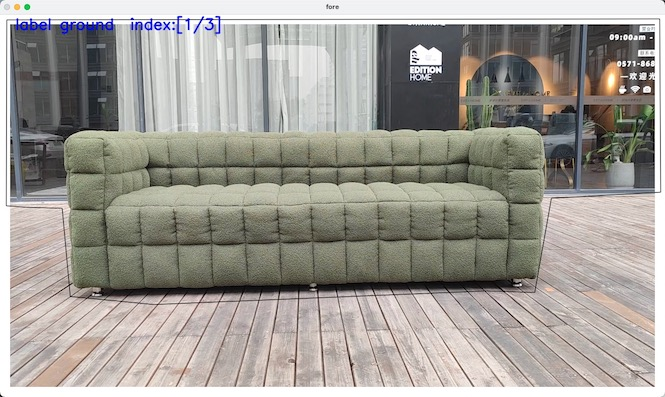

# ObjectDrawer-ToolBox

ObjectDrawer-ToolBox is a graphical image annotation tool to generate ground plane masks for a 3D object reconstruction system, [Object Drawer](https://objectdrawer.alibaba.com/index.html).

## Prerequisites
* Python 3.8
* ffmpeg

## Requirements
```
opencv-python
ffmpeg-python==0.2.0
```


## Getting Started
Given the video captured by conventional recording devices, the ObjectDrawer-ToolBox is used to sample frames from the video and label the ground plane masks. In the ground plane mask task, you need to label 3 images and only keep ground pixels in these images.

Please run
```
python label_image.py \
  --video_path /path/to/your/videos.mp4 
```

#### How to annotate ground plane

1. Draw a polygon to cover the pixels area which are not belong to groud plane. Tips: `red / black` line denotes a unfinished / finished polygon.
2. Press `w` to delete non-ground pixels when finished a polygon drawing.
3. Repeat the step 1 & 2, until there are only ground plane areas in the image.

Operation Tips:
* Press ```w``` to delete pixels.  
* Press ```d``` to finish current annotation and start to label next image.  
* Press ```esc``` to clear candidate regions

**select pixels**




**delete pixels**


### Annotation result
After ground plane annotation, a zip file named "label_${videos}.zip" is generated in same directory as the input video.  
Upload the video ("videos.mp4") and zip file on the website of [Object Drawer](https://objectdrawer.alibaba.com/index.html). 

## Examples
To clarify the label data format, we provided examples `video` & `label file`. You can download these data and submit to the Object Drawer website for testing.

Name | Video | Label File
---|---|---
multi-seat sofa | [download (.mp4)](https://ossgw.alicdn.com/homeai-inner/model/2b3ea8c8-6cb9-4ba4-9ca5-51e6bf32edb5.mp4) | [download (.zip)](http://homeai.oss-cn-beijing.aliyuncs.com/homelab/shuqi/object_drawer_website/examples/030ae8f6-bdbb-4e5f-be56-d94dd153b0c0.zip)
single sofa | [download (.mov)](https://ossgw.alicdn.com/homeai-inner/model/f45bb3b4-15da-41bc-8d89-29ceb6badf58.mov) | [download (.zip)](http://homeai.oss-cn-beijing.aliyuncs.com/homelab/shuqi/object_drawer_website/examples/6da55f6a-0288-43f4-94d9-1f2dd03005c3.zip)


## Acknowledgements
Thanks to [PlenOctree](https://github.com/sxyu/volrend) for the octree converter and online viewer. We take [U2NeT](https://github.com/xuebinqin/U-2-Net) as the segmentation algorithm. Please consider citing their papers and following their license.