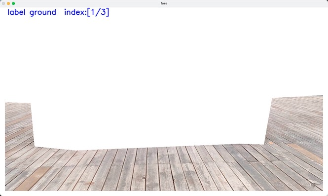
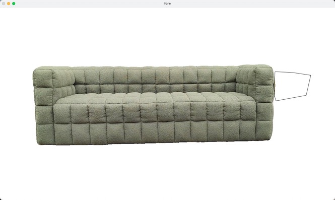
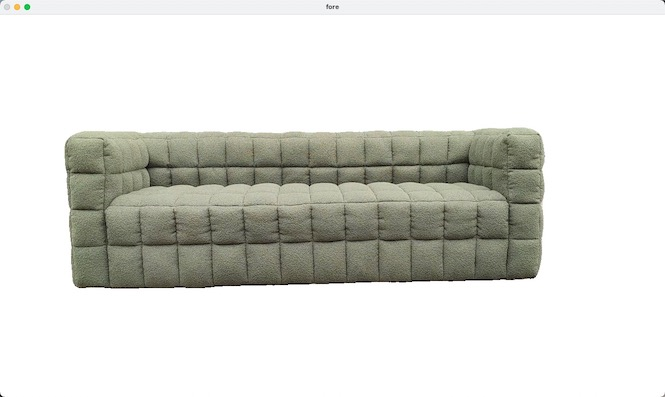

# ObjectDrawer-ToolBox

ObjectDrawer-ToolBox is a graphical image annotation tool to generate segmentation masks for a 3D object reconstruction system, [Object Drawer](https://objectdrawer.alibaba.com/index.html).

## Prerequisites
* Python 3
* NVIDIA GPU + CUDA CuDNN
* ffmpeg

## Requirements
```
opencv-python
torch==1.4.0  
ffmpeg-python==0.2.0
```


## Getting Started
### Download segmentation models

* Download the segmentation models from the [DropBox](https://www.dropbox.com/sh/oymyvapnmmam917/AABVB5Ibei87HQ0ZYNUMggCZa?dl=0)
* replace the folder `asserts` in `utils/asserts` with downloaded `asserts`.

### Step 1
Sample frames from a video, and run image segmentation for foreground object.
* seg_type: 
  * 0 -- small objects (e.g. shoes, toy, cup and so on)
  * 1 -- furnitures(e.g. chair, table, sofa, bed and so on)
```
python seg_video.py \
  --video_path /path/to/your/videos.mp4 \
  --seg_type 1
```

### Step 2

Annotate images based on the segmentation results at Step 1. There are 3 type data needed to label at this step:
* The front view of the object: select one image as front view.
* Ground plane mask: label 3 images and only keep ground pixels in these images.
* Correct segmentation results at Step 1.

Please run
```
python label_image.py \
  --video_path /path/to/your/videos.mp4 
```

#### 1. Select the front view

Click the image which is closest to front view


#### 2. Annotate ground plane

Delete pixels which are not belong to ground plane.

* Press ```w``` to delete pixels.  
* Press ```d``` to finish current annotation and start to label next image.  
* Press ```esc``` to clear candidate regions

**select pixels**




**delete pixels**


#### 3. Correct image segmentation at Step 1

Press ```w``` to delete or add pixels.  
Press ```d``` to finish current annotation and start to label next image.  
Press ```a``` to switch to previous image  
Press ```esc``` to clear candidate regions


**select pixels**



**delete pixels**



### Annotation result
After Step 1 & Step 2, a zip file named "label_${videos}.zip" is generated in same directory as the input video.  
Upload the video ("videos.mp4") and zip file on the website of [Object Drawer](https://objectdrawer.alibaba.com/index.html). 

## Examples
To clarify the label data format, we provided examples `video` & `label file`. You can download these data and submit to the Object Drawer website for testing.

Name | Video | Label File
---|---|---
multi-seat sofa | [download (.mp4)](https://ossgw.alicdn.com/homeai-inner/model/2b3ea8c8-6cb9-4ba4-9ca5-51e6bf32edb5.mp4) | [download (.zip)](https://ossgw.alicdn.com/homeai-inner/model/030ae8f6-bdbb-4e5f-be56-d94dd153b0c0.zip)
single sofa | [download (.mov)](https://ossgw.alicdn.com/homeai-inner/model/f45bb3b4-15da-41bc-8d89-29ceb6badf58.mov) | [download (.zip)](https://ossgw.alicdn.com/homeai-inner/model/6da55f6a-0288-43f4-94d9-1f2dd03005c3.zip)


## Acknowledgements
Thanks to [PlenOctree](https://github.com/sxyu/volrend) for the octree converter and online viewer. We take [U2NeT](https://github.com/xuebinqin/U-2-Net) as the segmentation algorithm. Please consider citing their papers and following their license.